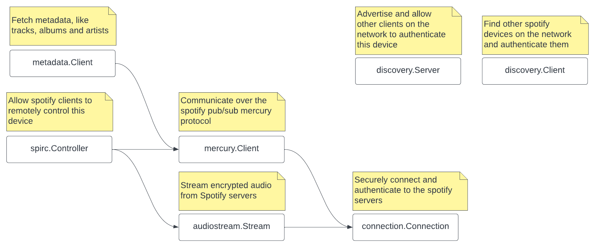

# Packages

Packages that are to be used by third-parties (like you) reside in the `pkg` folder. Internal packages like cryptography and protobuffers reside in the `internal` folder.

<figure markdown="1">
  
  <figcaption>An overview of public packages features in this library</figcaption>
</figure>

!!! info
    Reference the [Spotify Overview](../spotify/overview.md) to get an idea what each service provides.

!!! warning
    This page describes spotify services and features. That does not mean these are all - already - implemented in this library.

## Connection
The connection is the backbone of almost all services - discovery excluded - and is used to send and receive packets which can contain metadata, playback information, remote control commands and encrypted audio stream.

On creation the Connection connects to a random spotify server, performs handshaking and key negotiation and lastly authenticates with the given credentials. Credentials can be created from things like username/password and OAuth or are provided by the Discovery server.

All packet communication on the connection is asynchronous and in no particular order, therefore the connection must be read from constantly and interested parties must register themselves as command handlers (packets are prefixed with a command byte).

## Discovery
The discovery service is used to advertise as a Spotify-Connect device on the network, or to find Spotify-Connect devices on the network. Spotify clients will provide credentials when connecting to Spotify-Connect devices. These devices then use these credentials to login and start streaming music.

!!! info "When connecting..."
    When a spotify clients connects to a Spotify-Connect device, it expects that device to start broadcasting its device and playback state, which tells the spotify client that the device is now the active spotify client. As you may remember you can only stream music on one device, that is the 'active' device.

    Broadcasting and tracking this state is done by the SPIRC controller

## Mercury client

Mercury is a Spotify Publish/Subscribe protocol. It is used to request metadata server and communicate with other spotify clients.

## Metadata client

The metadata client uses a mercury connection to search and fetch all kinds of metadata ranging from tracks and podcasts to copyright information.

## Spirc controller

The SPIRC Controller is used to communicate with other spotify-clients authenticated as the same user or connected to the same Spotify-Connect device. 

It is responsible for providing device and playback state (like the current song) and for processing commands (like *skip song*).

## Audio stream

!!! danger
    Do not attempt to use the audiostream to pirate songs. We do not endorse pirating music and will not provide any help in that effort.

The audiostream is responsible for requesting encrypted audio chunks and decrypting them.