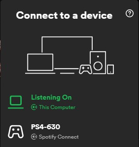

# Spotify overview

This page attempts to summarize spotify terminology/features/services, for more detailed explanation and functioning see the associated pages.

## Secure connection

Every connection with the spotify servers use a TCP connection framed messages (packets). Packets usually consist of some metadata followed by packet length and marshalled protobuffer.

1. TCP Connect to a random AP from [apresolve.spotify.com](http://apresolve.spotify.com:80)
2. Negotiate keys (using Diffie-Hellman) and start using Shannon encrypted packets
3. Login using some credentials

## Mercury

The Mercury protocol provides a more dynamic communication between the Spotify server and client for transferring documents. The Mercury request/replies are URI based and contain metadata as headers, such as caching-policy and status-codes.

The Mercury service is used for:

- Performing searches, returns tracks, albums, artist, podcasts, etc... Everything you'd see in your Spotify app;
- requesting specific metadata such as: track information, artist biography, copyright, restrictions, etc...;
- providing publish/subscribe messaging to spotify-clients authenticated as the same user (see [SPIRC](#spirc))

## Metadata

Metadata such as: searching, tracks, albums, artist, copyright and more are provided over the Mercury protocol in asynchronous request/response format.

## SPIRC

SPIRC is used by Spotify clients (authenticated as the same user) to communicate with eachother, like providing device and playback state.

When you open Spotify on another device you'll notice a greenbar indicating that spotify is currently playing on another device. Your client used SPIRC to broadcast a hello-message, to which your other client responds with its state; in this case indicating that it is the active (currently playing) device.

!!! info "SPIRC and Spotify-Connect devices"
    When you're connected to a Spotify-Connect device - such as a speaker or television - that device is now logged in as you and therefore broadcasts and processes SPIRC messages. This is how another device is controlled.

The Mercury service provides a publish/subscribe channel with your active Spotify client.

SPIRC is used for:

- Broadcasting playback information (current song, playlist, queue) to your other spotify clients;
- controlling other spotify clients by sending commands such as: pause, skip song, change playlist, queue something; 

## Audio stream

The audiostream is used to start streaming audio from the spotify server. The stream is divided into encrypted chunks. The audiostream requests each chunk and decrypts its contents, which can then be used by an audio-backend to play the audio through the speakers.

## Discovery

Discovery is the process of finding Spotify-Connect devices on the network and providing login credentials.

<figure markdown="1">
  
  <figcaption>Spotify-Connect</figcaption>
</figure>

Devices are advertised using mDNS/ZeroConf/Bonjour. Each device exposes a small HTTP server which is used to get extra information about the device and to authenticate with the device.

When a client connects to a device, it will provide login credentials through the HTTP server. The device then authenticates with the Spotify network and start broadcasting its state through [SPIRC](#spirc).